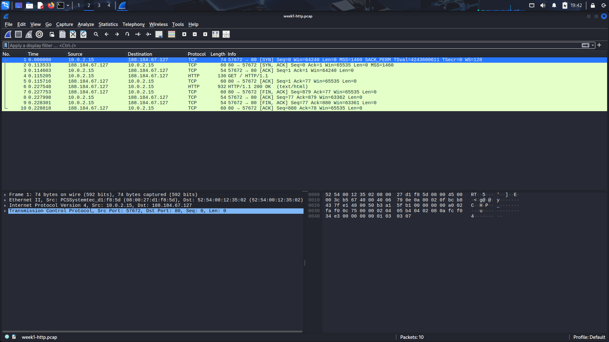
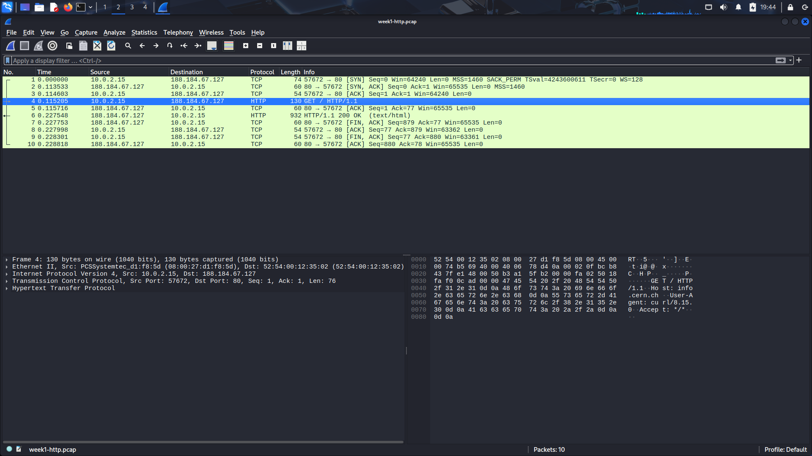
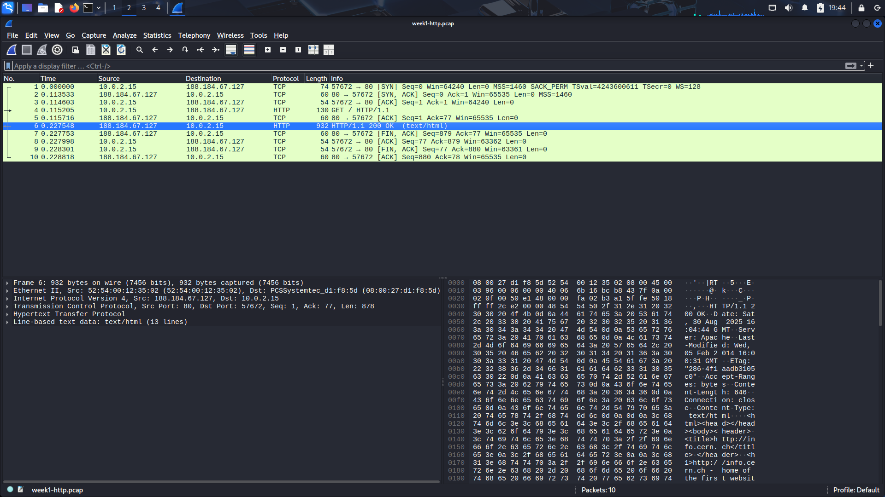

# Week 1 - HTTP Packet Analysis

This report details the analysis of a basic HTTP GET request to **info.cern.ch**. The process includes the capture methodology, the secure transfer of evidence files, and an analysis of three key packets.

## 1. Methodology

### 1.1. Packet Capture
The traffic was generated and captured entirely within a Kali Linux VM.

- **Capture Tool:** `tcpdump` was used to listen on the primary network interface (`eth0`) for traffic on port 80.
```bash
sudo tcpdump -i eth0 -w week1-http.pcap 'port 80'
```

- **Traffic Generation:** A simple HTTP GET request was generated using `curl`.
```bash
curl http://info.cern.ch
```
This resulted in the `week1-http.pcap` file containing the full TCP and HTTP conversation.

### 1.2. Secure File Transfer
To move the evidence (`.pcap` and analysis screenshots) from the Kali VM to the host machine for documentation, a secure channel was established using **SSH** and **SCP**, applying the *Principle of Least Privilege*.

- **Dedicated User:** A new, non-administrative user (`filedrop`) was created on the host machine to serve as a secure destination for the files, preventing direct access to the main user account.
```bash
# On the host machine
sudo adduser filedrop
```

- **Key Authentication:** An SSH key pair was generated on the Kali VM, and the public key was authorized for the `filedrop` user on the host. This enforces key-only authentication.
```bash
# On the Kali VM
ssh-copy-id filedrop@192.168.56.1
```

- **Secure Copy (SCP):** The files were securely transferred from the Kali VM to the `filedrop` user's home directory on the host machine.
```bash
# On the Kali VM
scp week1-http.pcap filedrop@192.168.56.1:/home/filedrop/
scp *.png filedrop@192.168.56.1:/home/filedrop/
```

## 2. Packet Analysis

### Packet 1: The TCP Handshake (SYN)
This is the first packet in the three-way handshake, initiating the connection between the client (Kali VM) and the server. It's interesting because it's the very start of the conversation.

- **Tshark Command to Find:**
```bash
tshark -r week1-http.pcap -Y "tcp.flags.syn == 1 && tcp.flags.ack == 0"
```
- **Screenshot:**
  

---

### Packet 2: The HTTP GET Request
This packet contains the client's actual request for the web page content. You can clearly see the `GET /` method, the host being requested (`Host: info.cern.ch`), and the `User-Agent` string, which identifies the client software (`curl`).

- **Tshark Command to Find:**
```bash
tshark -r week1-http.pcap -Y "http.request"
```
- **Screenshot:**
  

---

### Packet 3: The HTTP 200 OK Response
This is the server's confirmation that the request was successful (`200 OK`). The packet's data section contains the actual HTML of the web page. This packet confirms the successful completion of the web request.

- **Tshark Command to Find:**
```bash
tshark -r week1-http.pcap -Y "http.response"
```
- **Screenshot:**
  
